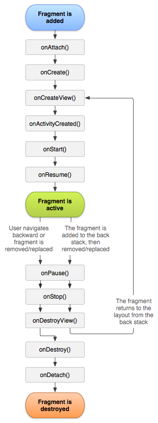

# Fragment

Fragment就像一个嵌套的activity，拥有自己的布局（layout）并管理自己的生命周期。降低耦合性。

## fragment生命周期

 

## activity 和 fragment 生命周期对比

 

## 示例

创建

```
public class BaseFragment extends Fragment {
	@Override
    public View onCreateView(LayoutInflater inflater, ViewGroup container,Bundle savedInstanceState) {
        return inflater.inflate(R.layout.article_view, container, false);
    }
}
```

初始化

```
private void initFragment(){
    //兼容2+版本的管理器 获得管理器
    FragmentManager fm = getSupportFragmentManager();
    //开始事务
    FragmentTransaction transaction = fm.beginTransaction();
    // 用fragment替换帧布局;参1:帧布局容器的id;参2:是要替换的fragment;参数3:标记
    //用fragment替换原来的布局文件
    transaction.replace(R.id.fl_left_menu, new BaseFragment(),TAG_LEFT_MENU);
    transaction.commit();// 提交事务
}
```

需要注意的是，通常把原来的布局文件掏空，并且使用`FrameLayout`布局。如：

```
<?xml version="1.0" encoding="utf-8"?>
<FrameLayout xmlns:android="http://schemas.android.com/apk/res/android"
    android:id="@+id/fl_left_menu"
    android:layout_width="match_parent"
    android:layout_height="match_parent">
</FrameLayout>
```

