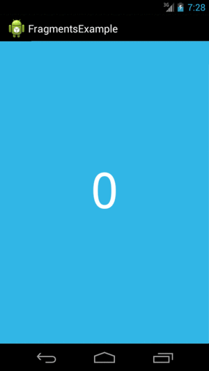

# Android动画——ViewPager

ViewPager能自动实现屏幕滑动动画。屏幕划动是在两个完整界面间的转换，它在一些UI中很常见，比如设置向导和幻灯放映。ViewPager常用于制作APP的向导。

 

## 示例：

layout.xml

 ```
<android.support.v4.view.ViewPager
        android:id="@+id/vp_guide"
        android:layout_width="match_parent"
        android:layout_height="match_parent"></android.support.v4.view.ViewPager>
 ```

.java(onCreate)

```
ViewPager mViewPager = (ViewPager) findViewById(R.id.vp_guide);
mViewPager.setAdapter(new GuideAdapter());
```


