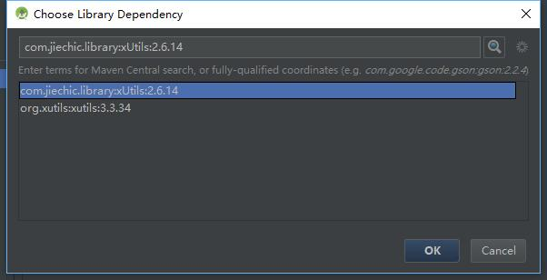
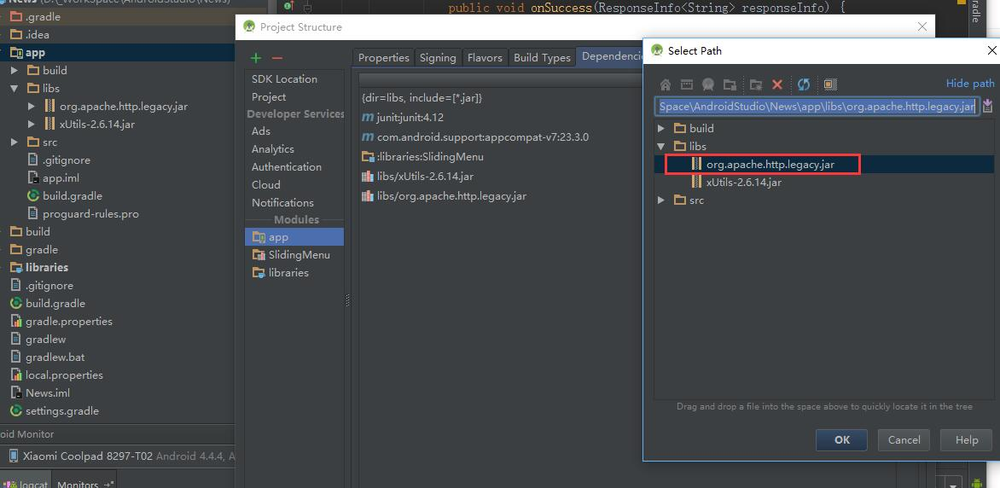

# xUtils

[xUtils2](https://github.com/wyouflf/xUtils) 

[xUtils3](https://github.com/wyouflf/xUtils3)

## 导入库

### 方法1

在所在 module 的 .gradle 文件中添加一下依赖即可

xUtils3:  `compile 'org.xutils:xutils:3.3.34'`

xUtils2: `compile 'com.jiechic.library:xUtils:2.6.14`

### 方法2

直接打开 moduleSetting ,在Dependency里搜索下Utils 添加即可。原理同上。



> 以上都是导jar 包，如果需要方便查看源码直接上github下载源码导入到项目即可

## 常见问题

###xUtils2 错误1

```
Error:(54, 31) 错误: 无法访问HttpRequestBase
找不到org.apache.http.client.methods.HttpRequestBase的类文件
```

这是由于xUtils2对Android6.0 即编译版本为23 支持不太好造成的，官方也建议使用 xUtils3。

解决办法：

* 在`\sdk\platforms\android-23\optional\`目录下找到jar包`org.apache.http.legacy.jar` 复制到对应Module 的libs 下，引入即可。



