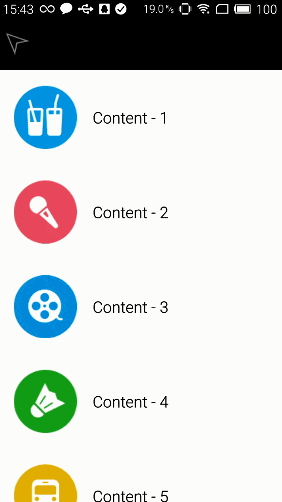

# SlidingMenu	侧边栏 

> 地址: https://github.com/jfeinstein10/SlidingMenu

效果图

 

## SlidingMenu使用

1. 引入SlidingMenu的库(AndroidStudio)

   引入到AndroidStudio中 参考: [SlidingMenu在Android Studio中的配置与使用](http://xlkgh.iteye.com/blog/2243960)

2. Activity继承SlidingFragmentActivity

3. onCreate改为public

   因为父类的该方法为 public

4. 配置左右两侧菜单布局

```
setBehindContentView(R.layout.menu_left);// 添加左侧菜单
```

```
SlidingMenu slidingMenu = getSlidingMenu();// 获取SlidingMenu对象
slidingMenu.setSecondaryMenu(R.layout.menu_right);// 设置右侧菜单
slidingMenu.setMode(SlidingMenu.LEFT_RIGHT);// 设置菜单展现模式, 左右两侧都展示

slidingMenu.setTouchModeAbove(SlidingMenu.TOUCHMODE_FULLSCREEN);// 设置触摸方式
slidingMenu.setBehindOffset(100);// 设置主页面剩余宽度
```
