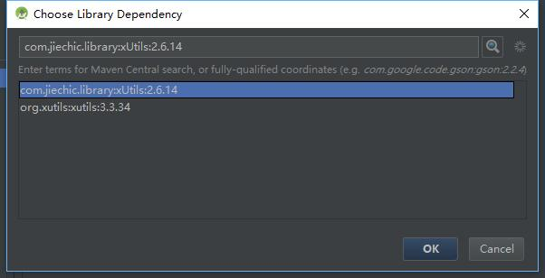
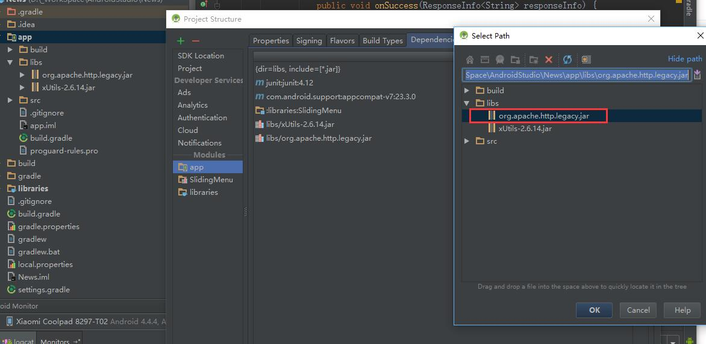

# xUtils

[xUtils2](https://github.com/wyouflf/xUtils) 

[xUtils3](https://github.com/wyouflf/xUtils3)

## 导入库

### 方法1

在所在 module 的 .gradle 文件中添加一下依赖即可

xUtils3:  `compile 'org.xutils:xutils:3.3.34'`

xUtils2: `compile 'com.jiechic.library:xUtils:2.6.14`

### 方法2

直接打开 moduleSetting ,在Dependency里搜索下Utils 添加即可。原理同上。



> 以上都是导jar 包，如果需要方便查看源码直接上github下载源码导入到项目即可

## 常见问题

###xUtils2 错误1

```
Error:(54, 31) 错误: 无法访问HttpRequestBase
找不到org.apache.http.client.methods.HttpRequestBase的类文件
```

这是由于xUtils2对Android6.0 即编译版本为23 支持不太好造成的，官方也建议使用 xUtils3。

解决办法：

* 在`\sdk\platforms\android-23\optional\`目录下找到jar包`org.apache.http.legacy.jar` 复制到对应Module 的libs 下，引入即可。



## DbUtils

```
public class DbHelper implements DbUtils.DbUpgradeListener {

    private static DbHelper dbHelper;
    private final String dbName = "ecssp.db";//数据库名称
    private int version;//数据库版本
    private DbUtils dbUtils;
    private String dbPath;
    private static final int BUFFER_SIZE = 8192;

    private DbHelper(Context context) {
        // TODO: 2016/7/27 暂时不必放到外置卡。方便调试。
        dbPath = Environment.getExternalStorageDirectory() + "/ecsspData";
        version = 1;// TODO: 2016/7/26 增加配置文件
        dbUtils = DbUtils.create(context, dbPath, dbName, version, null);
        dbUtils.configAllowTransaction(true);
        dbUtils.configDebug(true);// TODO: 2016/8/2  
    }

    /**
     * 只实例化一次
     *
     * @author Leon Liang
     * @created 2016/7/26 14:55
     */
    public static DbHelper getInstance(Context context) {
        if (dbHelper == null) {
            dbHelper = new DbHelper(context);
        }
        return dbHelper;
    }

    @Override
    public void onUpgrade(DbUtils dbUtils, int i, int i1) {
        // TODO: 2016/7/26 数据库升级

    }

    /**
     * 插入单条记录
     *
     * @author Leon Liang
     * @created 2016/7/26 14:56
     */
    public synchronized boolean save(Object entity) {
        try {
            dbUtils.save(entity);
        } catch (DbException e) {
            if (e != null)
                e.printStackTrace();
            return false;
        }
        return true;
    }

    /**
     * 插入表数据到数据库
     *
     * @param entity
     * @return boolean
     */
    public synchronized boolean saveAll(List<?> entity) {
        try {
            dbUtils.saveAll(entity);
        } catch (DbException e) {
            if (e != null)
                e.printStackTrace();
            return false;
        }
        return true;
    }

    public synchronized boolean dropByTable(Class<?> entity) {
        try {
            dbUtils.dropTable(entity);
        } catch (Exception e) {
            e.printStackTrace();
            return false;
        }
        return true;
    }

    /**
     * 删除一个对象
     *
     * @author Leon Liang
     * @created 2016/7/26 14:57
     */
    public synchronized boolean deleteByEntity(Object entity) {
        try {
            dbUtils.delete(entity);
        } catch (Exception e) {
            if (e != null)
                e.printStackTrace();
            return false;
        }
        return true;
    }

    public synchronized boolean deleteByList(List<?> entity) {
        try {
            dbUtils.deleteAll(entity);
            return true;
        } catch (DbException e) {
            e.printStackTrace();
            return false;
        }
    }

    /**
     * 按条件删除
     *
     * @author Leon Liang
     * @created 2016/7/26 15:58
     */
    public synchronized boolean deleteByValue(Class<?> entity, String colun, String value) {
        try {
            dbUtils.delete(entity, WhereBuilder.b(colun, "=", value));
        } catch (Exception e) {
            if (e != null)
                e.printStackTrace();
            return false;
        }
        return true;
    }

    /**
     * 更新或者插入表数据
     *
     * @author Leon Liang
     * @created 2016/7/26 15:59
     */
    public synchronized boolean update(Object entity) {
        try {
            dbUtils.saveOrUpdate(entity);//先去查这个条数据 根据id来判断是存储还是更新 如果存在更新
        } catch (Exception e) {
            e.printStackTrace();
            return false;
        }
        return true;
    }

    public synchronized boolean update(Object entity, String... value) {
        try {
            dbUtils.update(entity, value);
        } catch (Exception e) {
            if (e != null)
                e.printStackTrace();
            return false;
        }
        return true;
    }

    /**
     * 根据id查找
     *
     * @author Leon Liang
     * @created 2016/7/26 16:00
     */
    public synchronized <T> Object searchOne(Class<T> cla, int id) {
        try {
            return dbUtils.findFirst(Selector.from(cla).where(WhereBuilder.b("id", "=", id)));
        } catch (Exception e) {
            if (e != null)
                e.printStackTrace();
        }
        return null;
    }

    /**
     * 正叙查找 没有条件的
     *
     * @param entity 要查询的类
     * @param <T>    要查询的类
     * @return 查询到的数据
     */
    public synchronized <T> List<T> search(Class<T> entity) {
        try {
            return dbUtils.findAll(Selector.from(entity));
        } catch (Exception e) {
            if (e != null)
                e.printStackTrace();
        }
        return null;
    }

    /**
     * 查找所有数据并以id排序输出
     *
     * @param entityClass
     * @return 返回数据库中所有的表数据
     */
    public synchronized <T> List<T> searchAll(Class<T> entityClass) {
        try {
            return dbUtils.findAll(Selector.from(entityClass).orderBy("id", true));
        } catch (Exception e) {
            return null;
        }
    }

    /**
     * 条件查找
     *
     * @author Leon Liang
     * @created 2016/7/26 15:57
     */
    public synchronized <T> List<T> searchByValue(Class<T> entityClass, String column, String value) {
        try {
            return dbUtils.findAll(Selector.from(entityClass).where(WhereBuilder.b(column, "=", value)));
        } catch (Exception e) {
            return null;
        }
    }

    /**
     * 自定义Sql语句查找
     * 示例：
     * sqlInfo.setSql("select * from tbl_Student a,tbl_class b where a.stu_class_id = b.id and a.id > ?");
     *
     * @param sql
     * @return List<DbModel>
     */
    public synchronized List<DbModel> searchBySql(SqlInfo sql) {
        try {
            return dbUtils.findDbModelAll(sql); // 自定义sql查询
        } catch (DbException e) {
            e.printStackTrace();
            return null;
        }
    }

    /**
     * 执行指定文件中的脚本
     *
     * @param fileName    文件名
     * @param charsetName 字符集
     * @author 丘韫昕
     */
    public boolean executeSQLFile(Context mContext, String fileName, String charsetName) {
        try {
            InputStream inStream = new BufferedInputStream(mContext.getAssets().open(fileName));

            ByteArrayOutputStream outStream = new ByteArrayOutputStream();
            byte[] buffer = new byte[BUFFER_SIZE];
            int length = 0;
            while ((length = inStream.read(buffer)) != -1) {
                outStream.write(buffer, 0, length);
            }
            String sqlFileStr = new String(outStream.toByteArray(), charsetName);
            try {
                inStream.close();
            } catch (Exception e) {

            }
            try {
                outStream.close();
            } catch (Exception e) {
            }
            // 删除SQL语句中的注释
            sqlFileStr = SQLUtil.removeComment(sqlFileStr);
            //拆分成一条条Sql命令
            String[] sqls = SQLUtil.splitSQL(sqlFileStr);

            if (sqls != null) {
                // 遍历每一条SQL命令，执行该SQL命令
                for (String sql : sqls) {
                    // 删除空白字符
                    sql = sql.trim();
                    // 如果SQL语句非空，则执行该SQL语句
                    if (!sql.equals("")) {
                        //db.execSQL(sql);
                        //dbUtils.execQuery(sql);
                        dbUtils.execNonQuery(sql);
                    }
                }
            }
        } catch (Exception e) {
            return false;
        }
        return true;
    }

    /**
     * 保存或更新实体到DB（replace or insert）
     * @param entity
     * @return
     */
    public synchronized boolean saveOrUpdateAll(List<?> entity) {
        try {
            dbUtils.saveOrUpdateAll(entity);
        } catch (DbException e) {
            if (e != null)
                e.printStackTrace();
            return false;

        }
        return true;
    }
    /**
     * 判断表是否存在
     *
     * @author Leon Liang
     * @created 2016/8/3 23:05
     */
    public synchronized boolean tableIsExist(Class<?> cls) {
        try {
            return dbUtils.tableIsExist(cls);
        } catch (DbException e) {
            e.printStackTrace();
            return false;
        }
    }
    
```

